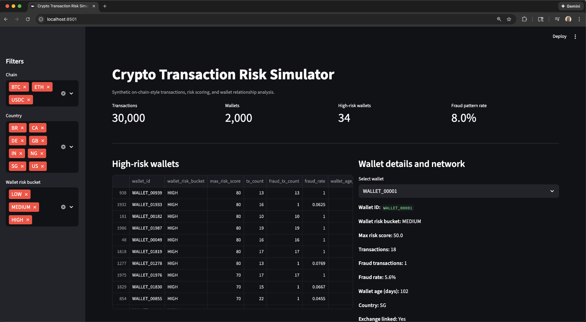
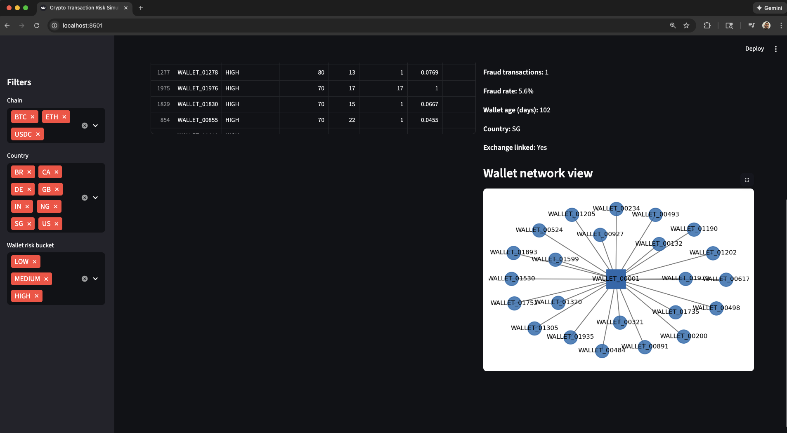
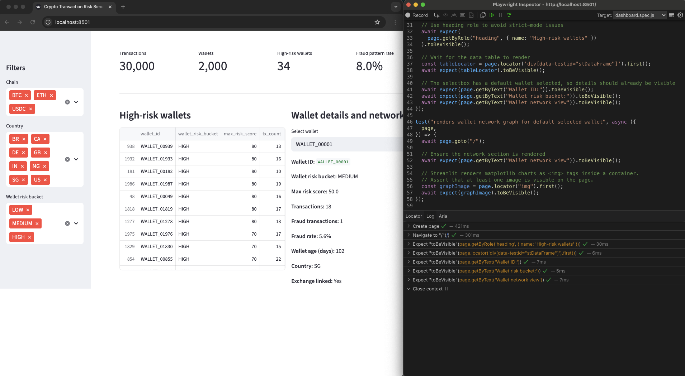
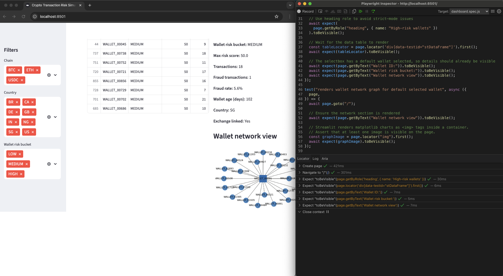

# Crypto Transaction Risk Simulator

Synthetic crypto-style transaction data, fraud patterns, rule-based scoring, and an interactive dashboard that mirrors how a crypto exchange or fintech might review risky wallets and high-risk flows.

---

<p align="center">
  <em>Streamlit dashboard showing portfolio KPIs, high-risk wallets, and a simple wallet network graph for connection analysis.</em>
</p>




---

<p align="center">
  <em>Playwright tests running in debug mode against the crypto risk dashboard</em>
</p>




---

## At a glance

**What this project demonstrates:**

- Ability to think like a crypto or payments risk analyst.
- Understanding of wallet-level and transaction-level risk signals.
- Python + pandas for synthetic data generation and transformation.
- Rule-based risk scoring designed to be explainable and interview-friendly.
- Streamlit dashboard that mimics internal risk tooling.
- Wallet network visualization using NetworkX + matplotlib.
- Playwright UI tests validating key analyst workflows.
- Jupyter Notebook exploration for clear analysis and communication.

**What you can review directly on GitHub:**

- Risk logic → `src/risk_rules.py`
- Data generation → `src/generate_data.py`
- Scoring pipeline → `src/run_scoring.py`
- Dashboard app → `dashboard/streamlit_app.py`
- UI tests → `ui-tests/tests/dashboard.spec.js`
- Notebook → `notebooks/crypto_risk_analysis.ipynb`
- Risk notes → `docs/Crypto_Risk_Report.md`

---

## What this project does

This is an end-to-end simulation of crypto transaction risk. It models wallets, synthetic on-chain transactions, simple fraud patterns, and an analyst workflow for reviewing risky entities.

### 1. Generates synthetic wallets and transactions

Wallets include:

- Country
- Wallet age (days)
- Flag for whether they appear “exchange-linked”

Transactions include:

- Timestamp
- Chain (e.g., Chain A, Chain B)
- From / to wallets
- Amount
- Simple pattern labels

Files generated:

- `data/wallets.csv`
- `data/transactions.csv`

### 2. Injects risk patterns inspired by real crypto behavior

Examples:

- **New wallet abuse** — very new wallets sending high-value transactions.
- **High-risk counterparties** — wallets that repeatedly appear in flagged patterns.
- **Concentrated flows** — many wallets sending into small hub wallets.
- **Chain-level / geo risk** — certain chains or countries become higher-risk segments.

Patterns are intentionally simplified but designed to spark interview-ready explanations.

### 3. Scores transactions via explainable rule-based logic

In `src/risk_rules.py`, each transaction receives:

- **risk_score** (numeric)
- **risk_bucket** (LOW / MEDIUM / HIGH)
- **is_fraud_pattern** (synthetic truth label)

`src/run_scoring.py` stores results in:

- `data/transactions_scored.csv`

Wallet-level risk is then aggregated for dashboard display.

### 4. Provides an analysis notebook

`notebooks/crypto_risk_analysis.ipynb` includes:

- Overall fraud pattern rate
- Risk bucket distribution
- Chain-level risk summary
- Top risky wallets by max risk score
- High-level takeaways for interview storytelling

The notebook is intentionally compact and easy to walk through in an interview.

### 5. Visualizes insights in a Streamlit dashboard

Features include:

- **KPIs:**

  - Total transactions
  - Total wallets
  - High-risk wallet count
  - Fraud pattern rate

- **Filters:**

  - Chain
  - Country
  - Risk bucket

- **High-risk wallet table** with:

  - Max risk score
  - Average and total transactions
  - Fraud transaction count and rate
  - Wallet age / country / exchange-linked indicator

- **Wallet detail panel** for selected wallet
- **Wallet network visualization** (NetworkX) to show connections

This mimics the flow of an internal triage or analyst review tool.

### 6. Adds Playwright UI tests to validate the dashboard

`ui-tests/tests/dashboard.spec.js` covers:

- Dashboard load + title
- KPIs visible
- High-risk wallet table renders
- Wallet selection flow
- Network graph rendering

This ties the project into a QA/automation mindset and demonstrates how UI checks support fraud tooling.

---

## Tech stack

- **Python** — generator, scoring logic, analysis
- **pandas** — data manipulation
- **Streamlit** — dashboard
- **NetworkX + matplotlib** — wallet graph visualization
- **Jupyter Notebook** — exploration + communication
- **Playwright (JavaScript)** — UI test automation
- **GitHub** — portfolio + version control

---

## Repository structure

```text
crypto-transaction-risk-simulator/
├─ data/
│  ├─ wallets.csv
│  ├─ transactions.csv
│  └─ transactions_scored.csv
│
├─ src/
│  ├─ generate_data.py
│  ├─ risk_rules.py
│  └─ run_scoring.py
│
├─ dashboard/
│  └─ streamlit_app.py
│
├─ notebooks/
│  └─ crypto_risk_analysis.ipynb
│
├─ ui-tests/
│  ├─ tests/
│  │  └─ dashboard.spec.js
│  ├─ package.json
│  └─ playwright.config.js
│
└─ docs/
   ├─ Crypto_Risk_Report.md
   └─ img/
      ├─ crypto_dashboard_1.png
      └─ crypto_dashboard_2.png
```

---

## How to review this project without running anything

1. **Risk rules:** see `src/risk_rules.py`
2. **Data pipeline:** see `src/generate_data.py` + `src/run_scoring.py`
3. **Dashboard logic:** see `dashboard/streamlit_app.py`
4. **UI automation:** see `ui-tests/tests/dashboard.spec.js`
5. **Risk notes:** see `docs/Crypto_Risk_Report.md`
6. **Notebook:** see `notebooks/crypto_risk_analysis.ipynb`

This gives full visibility into how crypto-style risk is modeled end-to-end.

---

## How to run locally (optional)

<details>
<summary>Setup and run instructions</summary>

### Clone repo

```bash
git clone https://github.com/cloudquiza/crypto-transaction-risk-simulator.git
cd crypto-transaction-risk-simulator
```

### Create and activate virtual environment

```bash
python3 -m venv .venv
source .venv/bin/activate
```

### Install dependencies

```bash
pip install -r requirements.txt
```

Or manually:

```bash
pip install pandas numpy streamlit networkx matplotlib jupyter
```

### Generate and score data

```bash
python src/generate_data.py
python src/run_scoring.py
```

### Launch dashboard

```bash
streamlit run dashboard/streamlit_app.py
```

### Open notebook

```bash
jupyter notebook
```

Open `notebooks/crypto_risk_analysis.ipynb`

</details>

---

## How to run UI tests (optional)

<details>
<summary>Playwright instructions</summary>

### Install Node dependencies

```bash
cd ui-tests
npm install
npx playwright install
```

### Run the dashboard (separate terminal)

```bash
source .venv/bin/activate
streamlit run dashboard/streamlit_app.py
```

### Run tests

```bash
npx playwright test
```

### Headed / Debug

```bash
npx playwright test --headed
npx playwright test --debug
```

</details>

---

## Why I built this

I created this project to practice how crypto-style transaction risk can be structured end to end:

- generating synthetic data
- designing explainable risk rules
- aggregating risk at wallet and portfolio levels
- visualizing behavior in a triage-style dashboard
- validating workflows with UI automation

It also gives me a fresh, concrete example to walk through in interviews and show how I think about crypto risk, portfolio analysis, and the intersection of risk and QA/automation.

If you work in crypto, payments risk, or trust & safety and have ideas on how to extend this simulator, I’d love to hear them.
